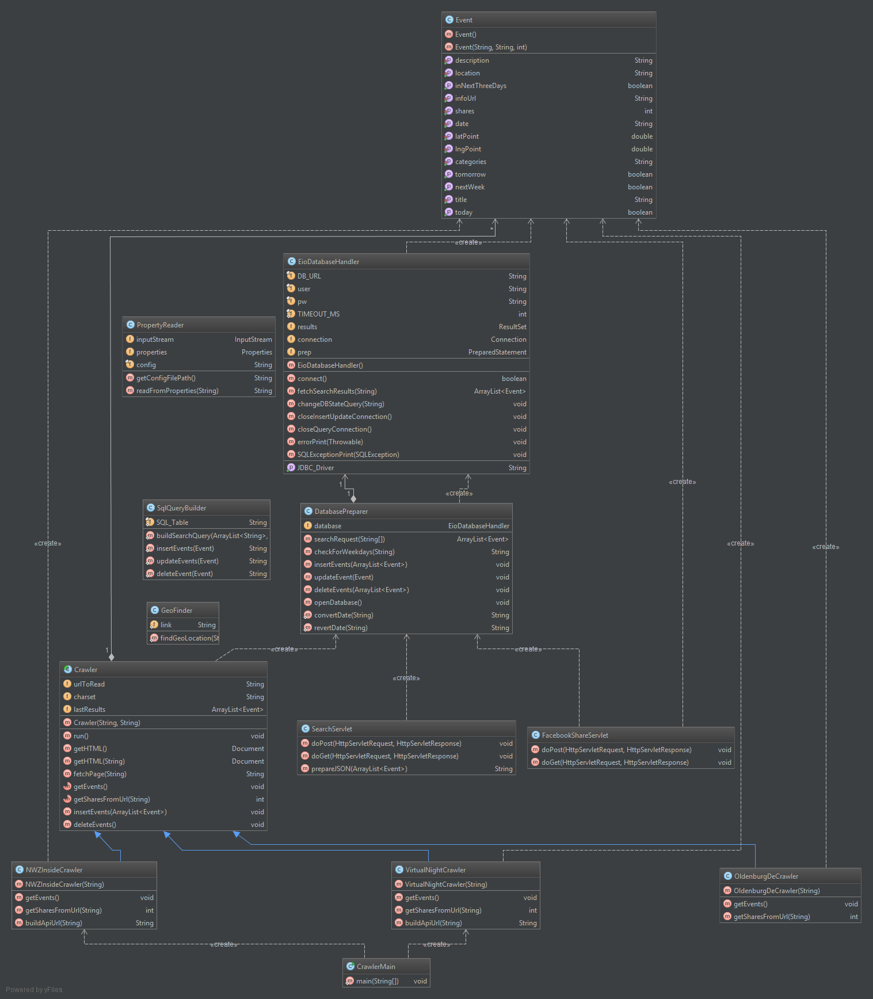

# EventFinder
The **EventFinder** searches for local events in Oldenburg and its surroundings. It uses the [Google Maps APIs](https://developers.google.com/maps/) to display events on a map with various additional information about the event such as a description.

In addition, the EventFinder uses **Webcrawler** to scan other websites for events.

## Installation
### Prerequisites
Jetty 9.3 requires Java 8 (or greater) to run. 

These additional commands are required to run the program:
```bash
JAVA=/usr/bin/java # Path to Java
NO_START=0 # Start on boot
JETTY_HOST=0.0.0.0 # Listen to all hosts
JETTY_ARGS=jetty.port=8085
JETTY_USER=<USER> # Run as this user
JETTY_HOME=/opt/jetty9
```

To build the site, use
### EventFinder
```bash
mvn clean install
```
Use the `target/eventfinder-1.0.war` to deploy the website.

### Database and the Crawler
A database to store event information has to be set up before using. This can be done in the [config.properties](src/main/resources/config.properties). The database is then used to store new events found by the crawler or to request them while using the **EventFinder**.

To start the crawler run the `main` within `de.EventCrawler.CrawlerMain` or build a `jar` with the given `MANIFEST.MF` within `de/META-INF/MANIFEST.MF` to let the crawler crawl indefinitely.

### Deploy
For *IntelliJ* follow the steps below:
1. In the `Run/Debug Configurations` settings select `Jetty Server` and then `local`. 
2. Set the `Application Server` to `/opt/jetty9` and the deployment artifact to `target/eventfinder-1.0.war` at the `Deployment` tab.
3. Press the `run` button

To deploy the Eventfinder on a website
1. Copy the `target/eventfinder-1.0.war` into your `/opt/jetty9/webapps/` dir.
2. Start the server by either running `java -jar start.jar` within your jetty home `/opt/jetty9/` or start the service by typing `service jetty start`.

## Backend Structure
This is a UML 2.0 Class diagram description of the Server Backend:

